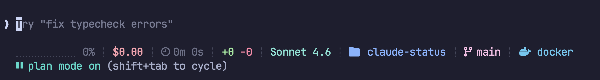

# Claude Status

> A live [Claude Code](https://claude.ai/code) status line for your terminal — context usage, cost, model, branch, worktree, and more.

[](https://claude.ai)
[](https://github.com/claude-contrib/claude-status/releases/latest)
[](LICENSE)

Claude Code's `statusLine` command fires on every tool call — but the raw JSON payload isn't something you can glance at. Claude Status turns that stream into a compact, color-coded status line you actually want to read.



## How It Works

Claude Code calls your `statusLine` command after each tool invocation, piping a JSON payload with session metadata. `claude-status` reads that payload, parses it with `jq`, and renders each segment using TrueColor ANSI escape codes — styled, colored, and joined into a single line.

> **Requires a TrueColor terminal.** Colors will not render on terminals that do not support 24-bit color. Most modern terminals qualify: iTerm2, Kitty, Alacritty, Warp, Ghostty, and Windows Terminal all work out of the box.

> **Running in a container or over SSH?** Make sure these environment variables are set:
>
> - `LANG=C.UTF-8` — needed for Unicode glyphs (Braille progress bar, Nerd Font icons)
> - `COLORTERM=truecolor` — needed for 24-bit color passthrough

## Requirements

- [Claude Code](https://docs.anthropic.com/en/docs/claude-code/setup) (`claude`)
- [jq](https://jqlang.github.io/jq/) (`jq`)
- A TrueColor terminal (iTerm2, Kitty, Alacritty, Warp, Ghostty, Windows Terminal)

**macOS (Homebrew):**

```bash
brew install jq
```

**Nix:**

```bash
nix profile install nixpkgs#jq
```

Install `claude` separately: [Claude Code installation guide](https://docs.anthropic.com/en/docs/claude-code/setup)

## Installation

### Using zinit

Add to your `~/.zshrc`:

```zsh
zinit light claude-contrib/claude-status
```

### Using Nix flakes

```sh
nix profile install github:claude-contrib/claude-status
```

Or in your `flake.nix` inputs:

```nix
inputs.claude-status.url = "github:claude-contrib/claude-status";
```

### Manual (zsh)

```zsh
git clone https://github.com/claude-contrib/claude-status ~/.local/share/claude-status
echo 'source ~/.local/share/claude-status/claude-status.plugin.zsh' >> ~/.zshrc
source ~/.local/share/claude-status/claude-status.plugin.zsh
```

### Manual (bash)

```bash
git clone https://github.com/claude-contrib/claude-status ~/.local/share/claude-status
echo 'export PATH="$HOME/.local/share/claude-status:$PATH"' >> ~/.bashrc
export PATH="$HOME/.local/share/claude-status:$PATH"
```

Requires [`jq`](https://jqlang.github.io/jq/) on your `$PATH` (`brew install jq`).

### Configure Claude Code

Set the status command in `~/.claude/settings.json`:

```json
{
  "statusLine": {
    "type": "command",
    "command": "claude-status"
  }
}
```

Restart your shell. The status line appears automatically on every Claude Code tool call.

## What You Get

Each segment is independently styled and only shown when relevant:

| Segment     | Example             | Description                                                              |
| ----------- | ------------------- | ------------------------------------------------------------------------ |
| Context bar | `⣿⣿⣿⣿⣀⣀⣀⣀⣀⣀ 42%`    | 10-char progress bar + percentage; green → yellow → red at 70%/90%       |
| Cost        | `$ 0.13`            | Total session cost in USD                                                |
| Agent       | `⚡ sub-agent`      | Active agent name — hidden when not in agent mode                        |
| Model       | `claude-sonnet-4-6` | Display name of the active model                                         |
| Directory   | `  my-project`     | Basename of the current working directory                                |
| Branch      | ` main`            | Active git branch (uses worktree branch when inside a worktree)          |
| Worktree    | `󰙅 feature-x`       | Active worktree name — hidden when not in a worktree                     |
| Time        | `󱑓 3m 42s`          | Total session duration; shows hours when over 60 minutes                 |
| Diff        | `+84 -12`           | Lines added (green) and removed (red) during the session                 |
| Nix         | ` 2.18.1`          | Nix icon + version — hidden when not inside `nix develop` or `nix-shell` |

## Configuration

| Variable                   | Values                                                                                                              | Default            | Description                                                                                      |
| -------------------------- | ------------------------------------------------------------------------------------------------------------------- | ------------------ | ------------------------------------------------------------------------------------------------ |
| `CLAUDE_CODE_STATUS_THEME` | `catppuccin-mocha` \| `catppuccin-macchiato` \| `catppuccin-frappe` \| `catppuccin-latte` \| `/path/to/custom.json` | `catppuccin-mocha` | Built-in [Catppuccin](https://catppuccin.com) theme or absolute path to a custom theme JSON file |

Set it in your `~/.zshrc` before the zinit load line:

```sh
export CLAUDE_CODE_STATUS_THEME=catppuccin-latte
zinit light claude-contrib/claude-status
```

## The claude-contrib Ecosystem

| Repo                                                                     | What it provides                                          |
| ------------------------------------------------------------------------ | --------------------------------------------------------- |
| [claude-extensions](https://github.com/claude-contrib/claude-extensions) | Hooks, context rules, session automation                  |
| [claude-features](https://github.com/claude-contrib/claude-features)     | Devcontainer features for Claude Code and Anthropic tools |
| [claude-languages](https://github.com/claude-contrib/claude-languages)   | LSP language servers — completions, diagnostics, hover    |
| [claude-sandbox](https://github.com/claude-contrib/claude-sandbox)       | Sandboxed Docker environment for Claude Code              |
| [claude-services](https://github.com/claude-contrib/claude-services)     | MCP servers — browser, filesystem, sequential thinking    |
| **claude-status** ← you are here                                         | Live status line — context, cost, model, branch, worktree |

## License

MIT — use it, fork it, extend it.
