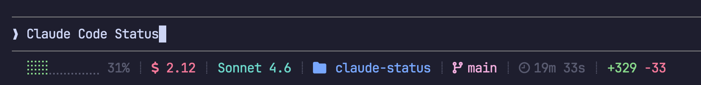

# Claude Status

> A zinit plugin that renders a live [Claude Code](https://claude.ai/code) status line in your terminal — context usage, cost, model, branch, worktree, and more.

[](https://github.com/claude-contrib/claude-status/releases/latest)
[](LICENSE)

Claude Code's `statusLine` command fires on every tool call — but the raw JSON payload isn't something you can glance at. Claude Status turns that stream into a compact, color-coded status line you actually want to read.



## How It Works

Claude Code calls your `statusLine` command after each tool invocation, piping a JSON payload with session metadata. `claude-status` reads that payload, parses it with `jq`, and renders each segment using TrueColor ANSI escape codes — styled, colored, and joined into a single line.

> **Requires a TrueColor terminal.** Colors will not render on terminals that do not support 24-bit color. Most modern terminals qualify: iTerm2, Kitty, Alacritty, Warp, Ghostty, and Windows Terminal all work out of the box.

The plugin (`claude-status.plugin.zsh`) installs the `claude-status` binary into `~/.local/bin/` via a symlink so it's always on your `$PATH`.

## Dependencies

- [`jq`](https://jqlang.github.io/jq/) — JSON parsing

```sh
brew install jq
```

## Quickstart

**1. Install via zinit** in your `~/.zshrc`:

```zsh
zinit light claude-contrib/claude-status
```

**2. Set the status command** in `~/.claude/settings.json`:

```json
{
  "statusLine": {
    "type": "command",
    "command": "claude-status"
  }
}
```

Restart your shell. The status line appears automatically on every Claude Code tool call.

## What You Get

Each segment is independently styled and only shown when relevant:

| Segment | Example | Description |
|---------|---------|-------------|
| Context bar | `⣿⣿⣿⣿⣀⣀⣀⣀⣀⣀ 42%` | 10-char progress bar + percentage; green → yellow → red at 70%/90% |
| Cost | `$ 0.13` | Total session cost in USD |
| Agent | `⚡ sub-agent` | Active agent name — hidden when not in agent mode |
| Model | `claude-sonnet-4-6` | Display name of the active model |
| Directory | `  my-project` | Basename of the current working directory |
| Branch | ` main` | Active git branch (uses worktree branch when inside a worktree) |
| Worktree | `󰙅 feature-x` | Active worktree name — hidden when not in a worktree |
| Time | `󱑓 3m 42s` | Total session duration; shows hours when over 60 minutes |
| Diff | `+84 -12` | Lines added (green) and removed (red) during the session |

## Configuration

| Variable | Values | Default | Description |
|----------|--------|---------|-------------|
| `CLAUDE_CODE_STATUS_THEME` | `dark` \| `light` | `dark` | Color palette — `dark` for dark terminal backgrounds, `light` for light ones |

Set it in your `~/.zshrc` before the zinit load line:

```sh
export CLAUDE_CODE_STATUS_THEME=light
zinit light claude-contrib/claude-status
```

## The claude-contrib Ecosystem

| Repo | What it provides |
|------|-----------------|
| [claude-extensions](https://github.com/claude-contrib/claude-extensions) | Hooks, context rules, session automation |
| [claude-services](https://github.com/claude-contrib/claude-services) | MCP servers — browser, filesystem, sequential thinking |
| [claude-languages](https://github.com/claude-contrib/claude-languages) | LSP language servers — completions, diagnostics, hover |
| **claude-status** ← you are here | zinit plugin — live status line for Claude Code |

## License

MIT — use it, fork it, extend it.
